# SickleLite-MorphFormer

Official repository for **SickleLite-MorphFormer: A Lightweight Morphology-Aware Hybrid Network for Sickle Cell Smear Classification Using Semi-Supervised Learning**.

## Overview

SickleLite-MorphFormer is a lightweight deep learning framework for sickle cell smear classification under limited labelled data conditions. The model combines morphology-aware texture extraction, spectral gradient analysis, contextual attention, adaptive feature fusion, and positive-unlabeled learning within a single architecture.

The framework processes blood-smear images of size 224×224 and divides each image into 64 overlapping patches of size 32×32 with 25% overlap. Three parallel branches then extract complementary information:

- Morphological Texture Branch (MTB)
- Spectral Gradient Branch (SGB)
- Contextual Attention Branch (CAB)

An adaptive fusion module combines the three branches using learnable weights before final classification.

---

## Repository Structure

```text
SickleLite-MorphFormer/
│
├── Code/
│   ├── training scripts
│   ├── evaluation scripts
│   ├── ablation scripts
│   └── utility functions
│
├── Figures/
│   ├── benchmark plots
│   ├── Grad-CAM visualizations
│   ├── ROC and PR curves
│   ├── confusion matrices
│   ├── learning curves
│   └── ablation figures
│
├── Trained-Models/
│   ├── saved checkpoints
│   ├── pretrained weights
│   └── best-performing models
│
├── README.md
├── LICENSE
└── sickle.png
```

---

## Proposed Architecture

<p align="center">
  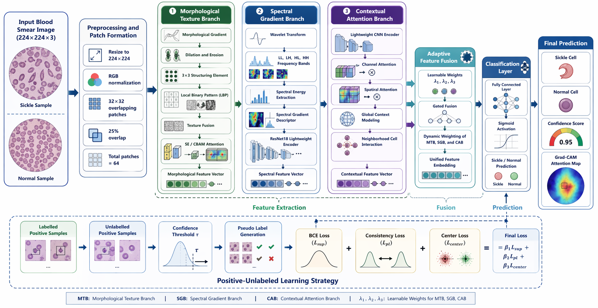
</p>

The proposed framework contains:

1. Morphological Texture Branch for elongated boundaries, crescent-like shapes, and irregular contour analysis.
2. Spectral Gradient Branch for wavelet decomposition and frequency-sensitive feature extraction.
3. Contextual Attention Branch for neighborhood-level interaction modeling.
4. Adaptive Feature Fusion with learnable weights λ1, λ2, and λ3.
5. Positive-Unlabeled Learning Strategy for pseudo-label generation and robust training under limited annotations.

---

## Dataset

The experiments use the public Sickle Cell Disease Dataset collected from Uganda.

- 422 positive sickle-cell images
- 147 negative images
- Labelled and unlabelled positive samples
- Images collected from Kumi Hospital, Soroti Regional Referral Hospital, and Soroti University

Dataset link:

```text
https://www.kaggle.com/datasets/florencetushabe/sickle-cell-disease-dataset/data
```

---

## Installation

Clone the repository:

```bash
git clone https://github.com/mishaurooj/SickleLite-MorphFormer.git
cd SickleLite-MorphFormer
```

Create a virtual environment:

```bash
python -m venv sicklelite
source sicklelite/bin/activate
```

Install dependencies:

```bash
pip install -r requirements.txt
```

---

## Training

Train the proposed model:

```bash
python sickle_morph.py --data_root ./dataset --mode train
```

Run ablation studies:

```bash
python sickle_morph.py --data_root ./dataset --mode ablation
```

Run benchmark comparison:

```bash
python sickle_morph.py --data_root ./dataset --mode benchmark
```

---

## Main Performance

| Model | Accuracy | Balanced Accuracy | Recall | F1 | MCC |
|------|------:|------:|------:|------:|------:|
| ResNet50 | 0.9333 | 0.9348 | 0.999 | 0.9362 | 0.8748 |
| EfficientNet-B0 | 0.9111 | 0.9111 | 0.9091 | 0.9091 | 0.8221 |
| MobileNetV3-Small | 0.9556 | 0.9555 | 0.9545 | 0.9545 | 0.9111 |
| SickleLite-MorphFormer | 0.9556 | 0.9565 | 0.9900 | 0.9565 | 0.9149 |

---

## Ablation Analysis

| Module | Configuration | Accuracy | Bal. Acc. | Recall | F1 | MCC |
|------|------|------:|------:|------:|------:|------:|
| Morphological Texture Branch | None | 0.9333 | 0.9348 | 0.999 | 0.9362 | 0.8748 |
| Morphological Texture Branch | SE | 0.9778 | 0.9783 | 0.999 | 0.9778 | 0.9565 |
| Morphological Texture Branch | CBAM | 0.9778 | 0.9783 | 0.999 | 0.9778 | 0.9565 |
| Spectral Gradient Branch | ResNet18 | 0.9778 | 0.9783 | 0.999 | 0.9778 | 0.9565 |
| Adaptive Feature Fusion | Gate | 0.9778 | 0.9783 | 0.999 | 0.9778 | 0.9565 |
| Positive-Unlabeled Learning | PMCL | 0.9778 | 0.9783 | 0.999 | 0.9778 | 0.9565 |

---

## Available Figures

### Main Benchmark Figures

<p align="center">
  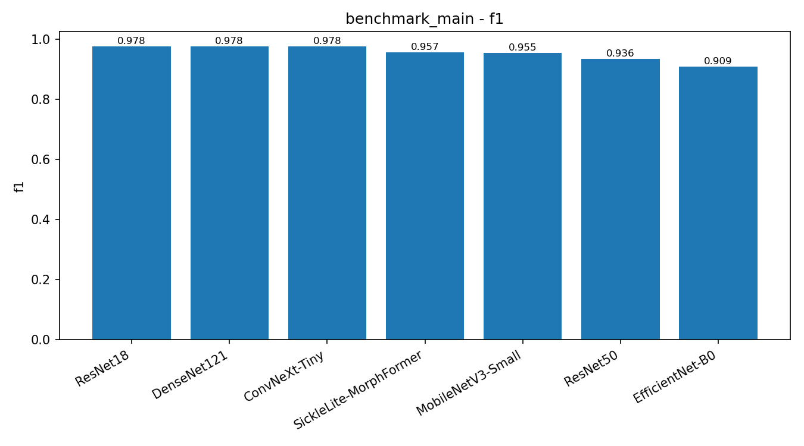
  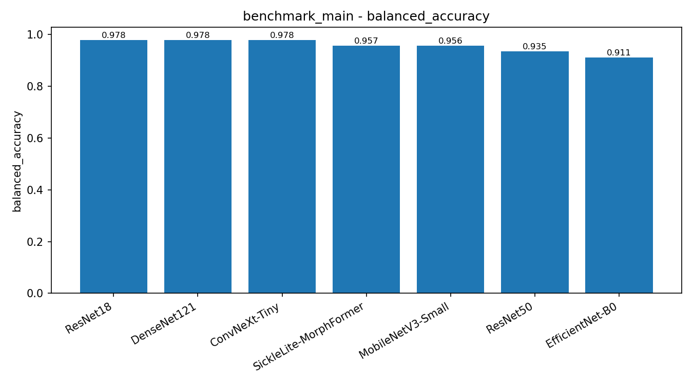
</p>

<p align="center">
  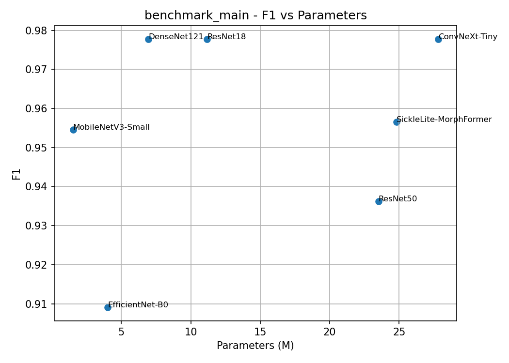
  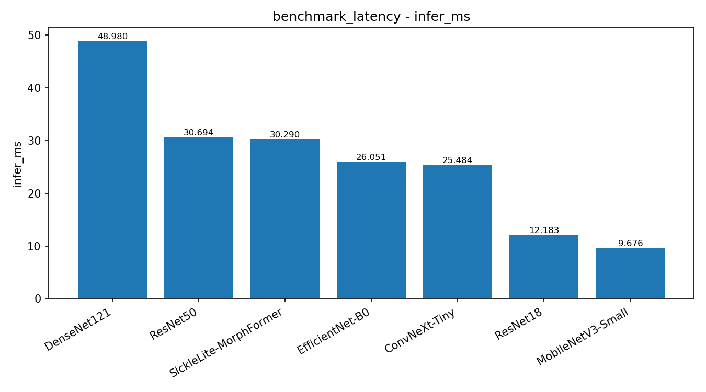
</p>

<p align="center">
  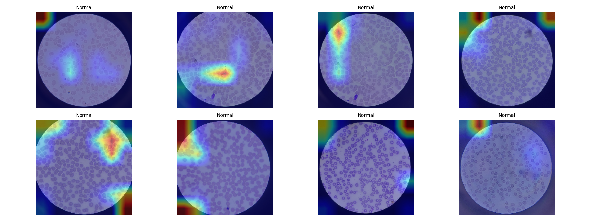
</p>

### Main Model Figures

<p align="center">
  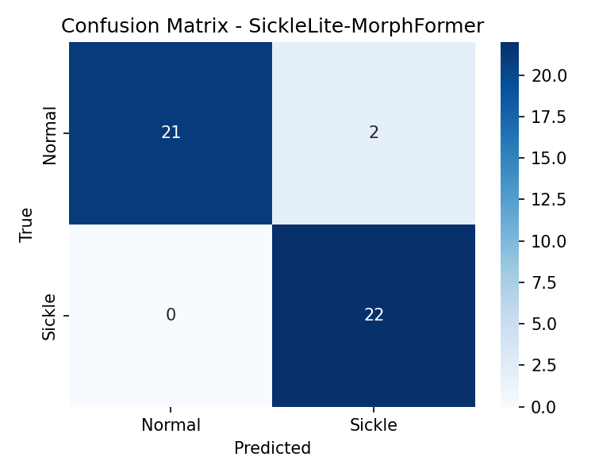
  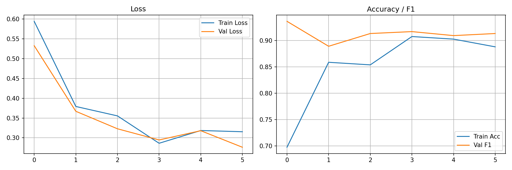
  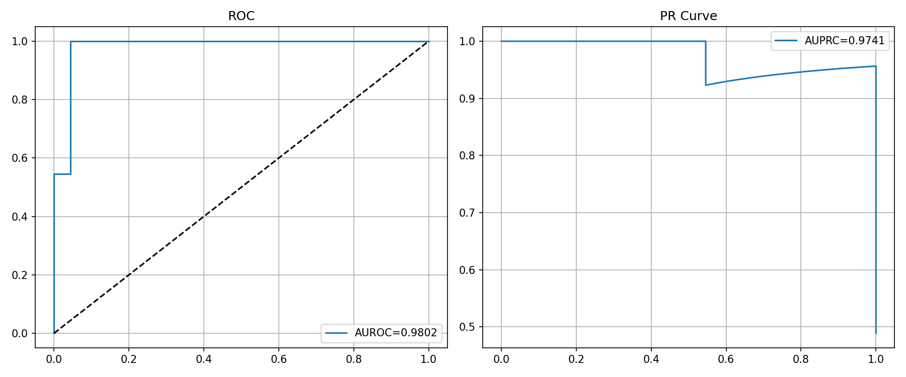
</p>

<p align="center">
  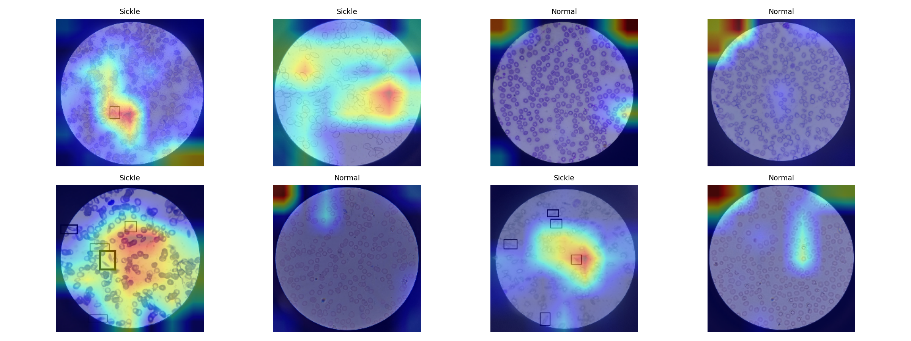
</p>

### Backbone Comparison Figures

<p align="center">
  
  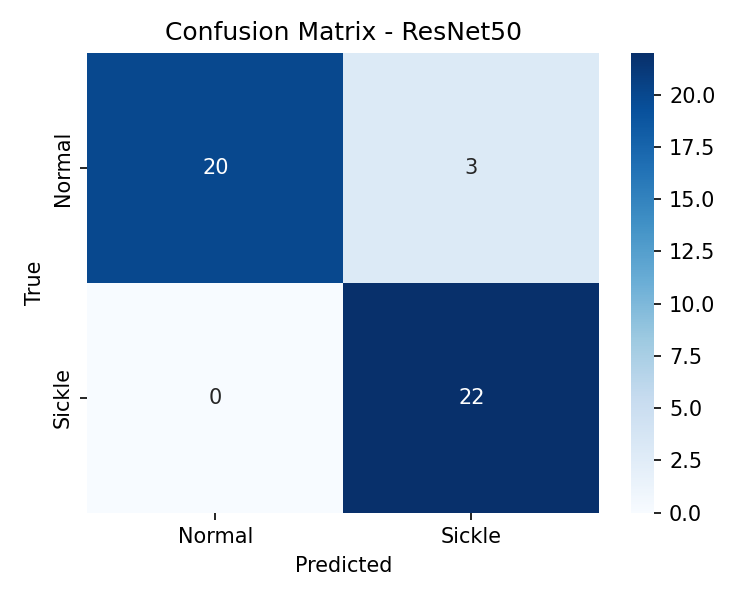
  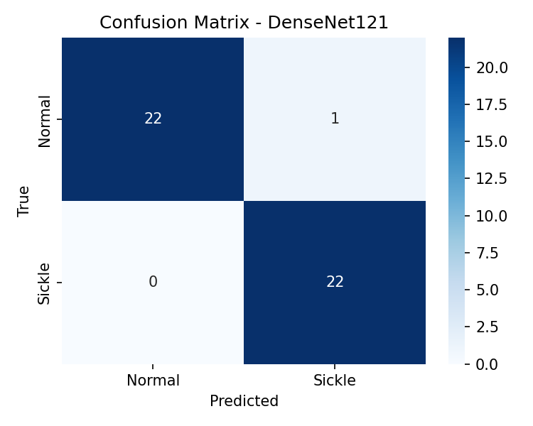
</p>

<p align="center">
  
  
  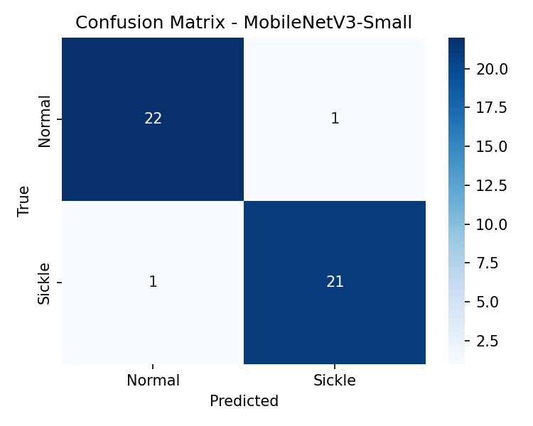
</p>

### Ablation Figures

<p align="center">
  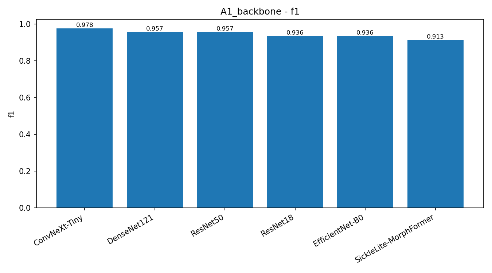
  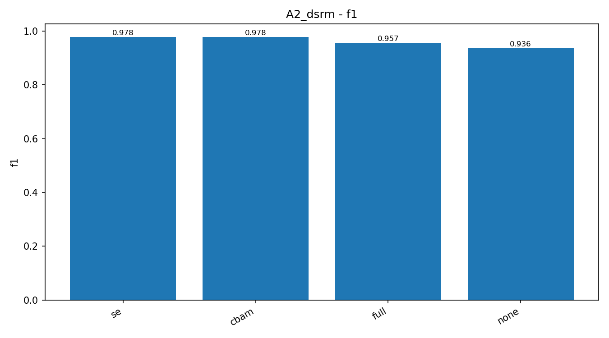
  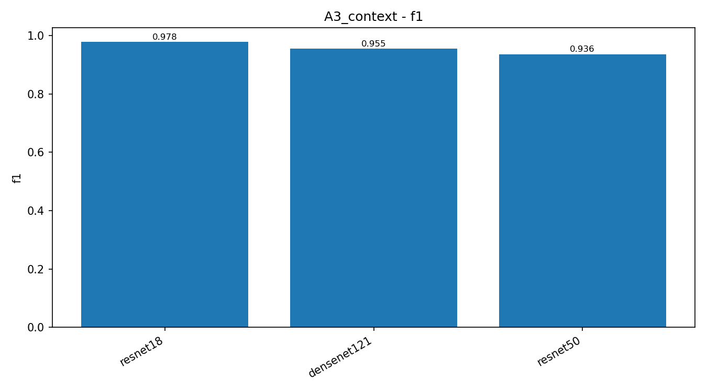
  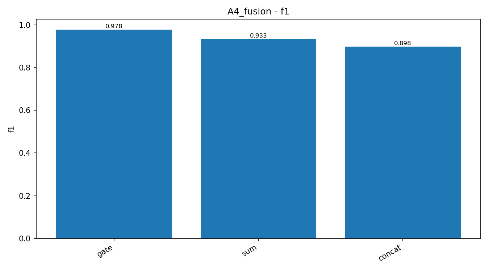
  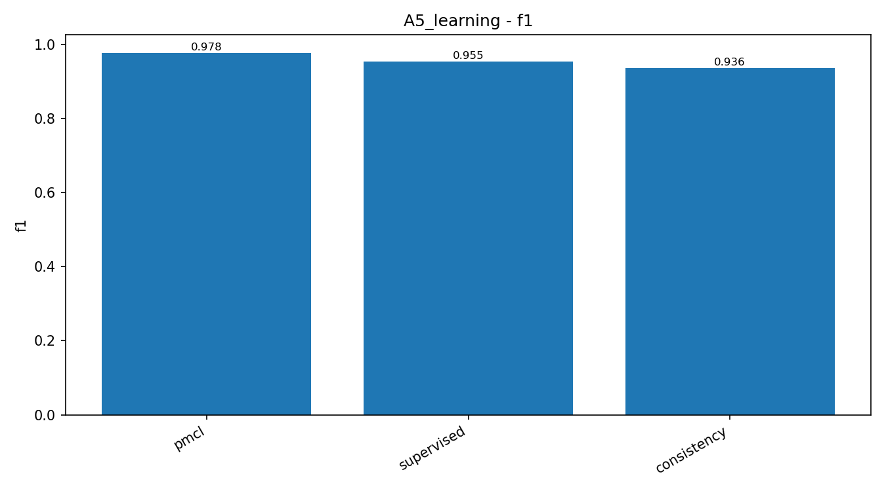
</p>

---

## Key Contributions

- Lightweight three-branch framework for sickle cell smear classification
- Morphology-aware texture extraction for elongated sickle-cell structures
- Spectral gradient analysis using wavelet decomposition
- Contextual attention for neighborhood-level feature modeling
- Adaptive gated fusion for branch weighting
- Positive-unlabeled learning with pseudo-label generation
- Strong performance under limited labelled data conditions

---

## Citation

```bibtex
@article{sicklelite2026,
  title={SickleLite-MorphFormer: A Lightweight Morphology-Aware Hybrid Network for Sickle Cell Smear Classification Using Semi-Supervised Learning},
  author={},
  journal={Under Review},
  year={2026}
}
```

---

## License

This repository is released under the Apache-2.0 License.

---

## Contact

For questions, collaboration, or dataset access:

```text
GitHub: https://github.com/mishaurooj/SickleLite-MorphFormer
Dataset: https://www.kaggle.com/datasets/florencetushabe/sickle-cell-disease-dataset/data
```

